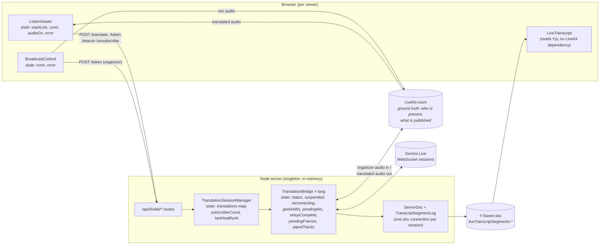
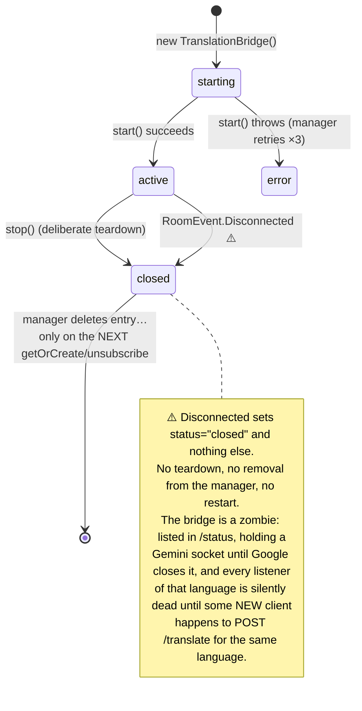
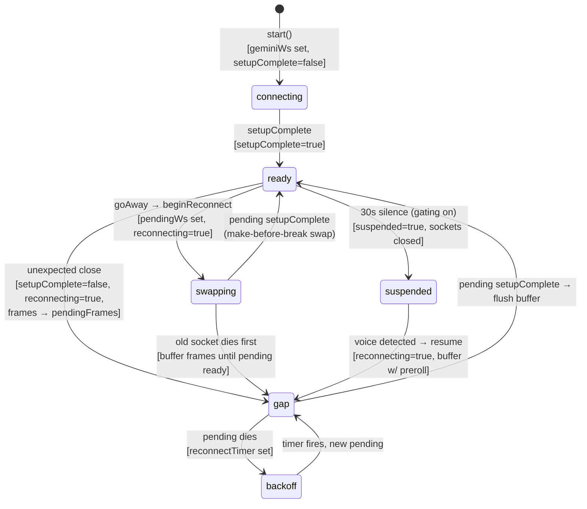
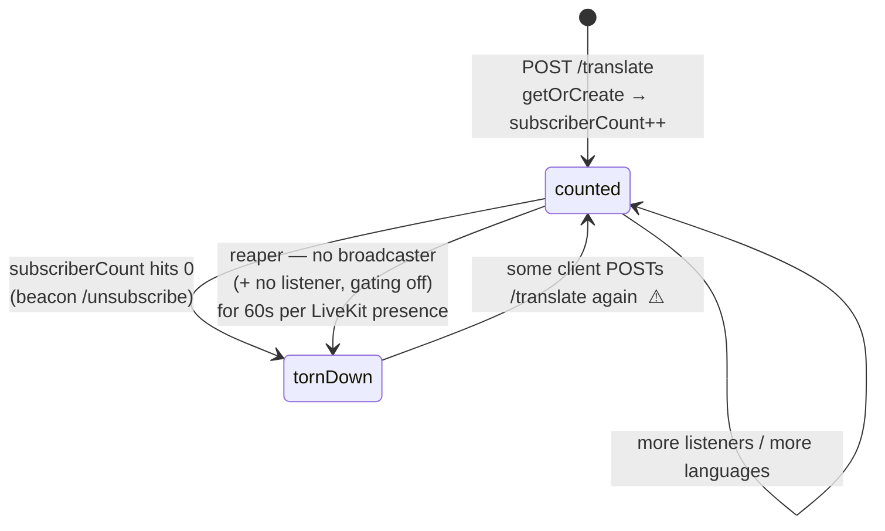
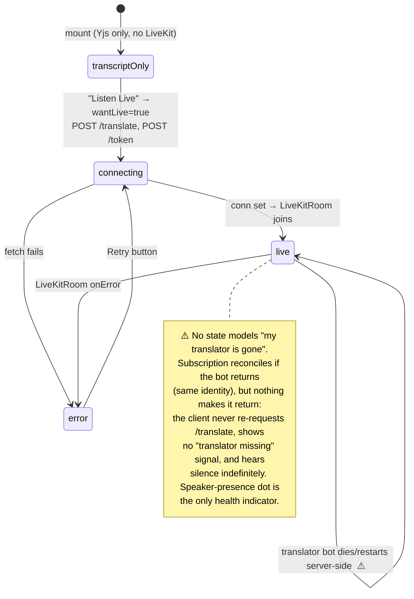
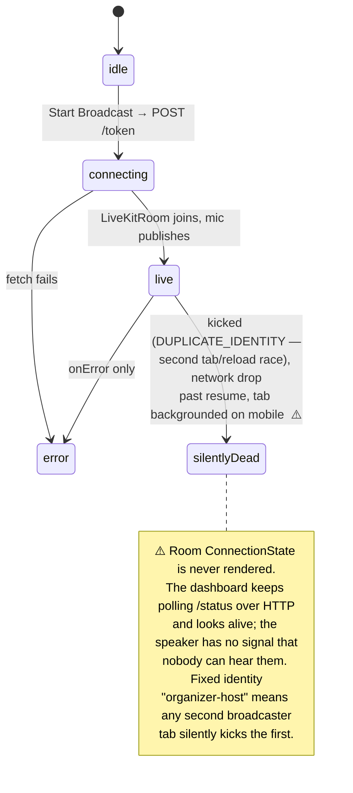
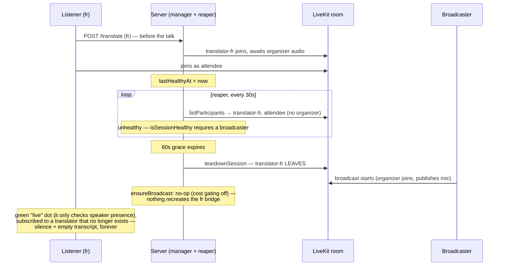
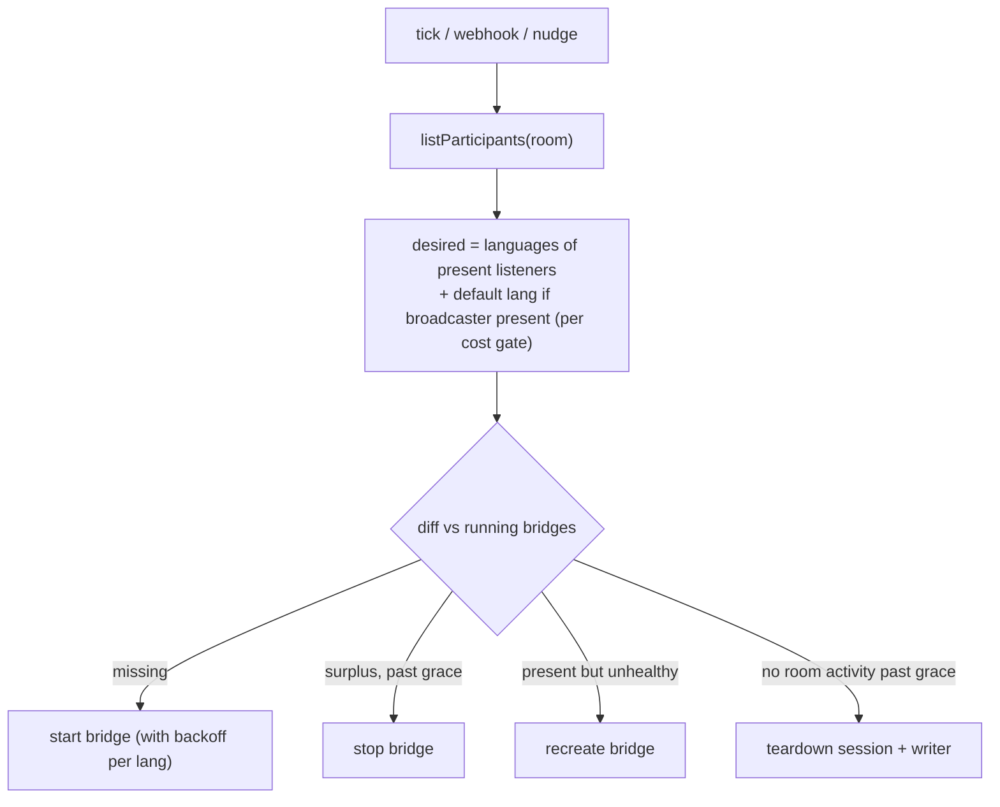

# Live translation: state audit and a reliability architecture

Why the live-translation subsystem keeps producing new state bugs, a map of every state
machine it actually contains (client and server), a catalog of the edge cases the current
code mishandles, a proposed architecture, and the hot fixes worth applying before any
rearchitecting.

Companion to [live-audio-resilience.md](live-audio-resilience.md), which covers the two
"active but deaf" outages on the bridge's *input* side. This document zooms out: the same
disease exists at every other layer, and the fixes so far have treated one organ.

## The thesis

The bridge's input side was fixed with a principle: **don't store a decision made from an
event; reconcile against current state, and watch for the invariant breaking.** That
principle was applied to exactly one edge of the system — "is the bridge subscribed to the
organizer's mic?" — because that's where the outages happened to land.

Every other piece of live-translation state is still managed the pre-outage way:

| State | Where it lives | How it's maintained | Reconciled? | Watched? |
| --- | --- | --- | --- | --- |
| Bridge ↔ organizer-audio subscription | bridge | reconcile + stall watchdog | ✅ | ✅ |
| Bridge lifecycle (`status`) | bridge + manager map | events, one-shot transitions | ❌ | ❌ |
| Gemini socket leg (5 interacting fields) | bridge | event handlers with implicit ordering assumptions | ❌ | partially (goAway/close only) |
| Which bridges should exist | manager (`subscriberCount`) | HTTP increments + `sendBeacon` decrements | ❌ (reaper is a partial backstop) | ❌ |
| Listener's connection to their translator | ListenViewer | one-shot fetch on opt-in | subscription yes, *bot existence* no | ❌ |
| Broadcaster's "am I live?" | BroadcastControl | `onError` only | ❌ | ❌ |

Everything in the ❌ rows is a *decision stored from an event*, drifting from reality until
something breaks. That is why fixing one incident keeps revealing the next: the bugs are
not independent — they are the same shape recurring in each unreconciled layer.

The second, quieter problem: the bridge's Gemini leg is not a state machine, it is **five
booleans and two nullable sockets** (`status`, `suspended`, `reconnecting`,
`geminiSetupComplete`, `pendingWs`, `geminiWs`, plus timers) whose legal combinations are
implicit. Several illegal combinations are reachable (catalogued below). Any async
callback — a websocket message, a timer — can fire in a state it was not written for, and
nothing checks.

## Component map and state ownership

Note the four **independent stores of "what should be running"**: the manager's
`subscriberCount`, the manager's `translations` map, the LiveKit participant list, and
each client's `wantLive`. Nothing reconciles them; each pairwise disagreement is a bug
class, and several have already fired.

## The state machines as actually implemented

### Server: bridge lifecycle (`status` × room)

`status: "active"` is also a lie in the small: it stays `"active"` while the Gemini leg is
down and retrying with 30s backoff, and while suspended for silence. The dashboard renders
this one word.

### Server: the Gemini leg (implicit machine, reconstructed)

This is the machine the code *means* to have. The fields in brackets are how each state is
actually encoded — note that no single variable tells you which state you're in:

Reachable **illegal** combinations (verified against the code):

1. **Swap-in after suspend/stop.** `onSocketReady`
   ([translation-bridge.ts:767](../live-audio/translation-bridge.ts#L767)) checks neither
   `status` nor `suspended`. `suspendForSilence()` / `stop()` close `pendingWs`, but a
   `setupComplete` already in flight still delivers: the dead-on-arrival socket is swapped
   in as `geminiWs`, `geminiSetupComplete=true`, `reconnecting=false` — while
   `suspended=true` (or the bridge is closed). Result: an open, paid-for Gemini session
   feeding nothing, invisible to every monitor, until Google closes it.
2. **`connectGemini` resolves on someone else's flag.** It polls the shared
   `geminiSetupComplete` ([translation-bridge.ts:632](../live-audio/translation-bridge.ts#L632))
   rather than the readiness of *its* socket — harmless today only because no other socket
   can exist during `start()`; it will bite the first time startup ordering changes.
3. **`Disconnected` leaves the Gemini leg running** (the zombie above): the room is gone
   but the goAway/close machinery only checks `status !== "active"` on *some* paths.

None of these are exotic — they are the generic failure of encoding a state machine as
cooperating booleans. Every new feature (silence gating was the latest) multiplies the
combinations and has to re-derive the invariants by hand. That is the "something is just
not reliably engineered" feeling: **the state space is implicit, so every change is a
gamble on remembering all of it.**

### Server: session lifecycle (manager)

`subscriberCount` is a **write-only ledger with two unreliable writers**:

- Incremented once per `POST /translate` — a page refresh, a React StrictMode
  double-effect, or a retry each add one.
- Decremented by `navigator.sendBeacon` on unload — which is best-effort, can be lost, and
  in `ListenAudio`'s cleanup also fires on ordinary React unmounts
  ([ListenViewer.tsx:97-110](../src/ListenViewer.tsx#L97-L110)).
- **Clobbered on creation**: `ensureBridge` assigns `subscriberCount = 1` *after*
  `await bridge.start()`
  ([translation-session-manager.ts:294](../live-audio/translation-session-manager.ts#L294)),
  overwriting increments made by concurrent callers who were handed the still-`starting`
  bridge at [line 248](../live-audio/translation-session-manager.ts#L248).

Drift low → a language is torn down **while someone is still listening**, and (⚠️ above)
nothing recreates it, because no existing client ever re-POSTs `/translate`. Drift high →
bots outlive their listeners until the reaper's coarse room-level rule catches them.

The reaper is the one component that already reconciles against ground truth (LiveKit
presence) — but it can only *tear down*, never *build up*, and it operates per-session,
not per-language.

### Client: listener

### Client: broadcaster

## Edge-case catalog

Severity: 🔴 user-facing outage, 🟠 degraded/confusing, 🟡 waste/latent.

### Case study (observed 2026-07-19): the waiting-room reap

A French listener opts in *before* the broadcast starts. The translator bot joins, then
leaves ~60–90s later; when the broadcast begins, the listener sits with a green "live"
dot, hearing and seeing nothing, indefinitely.

Two rules compose into the outage, and each is individually defensible:

1. `isSessionHealthy` ([translation-session-manager.ts:65](../live-audio/translation-session-manager.ts#L65))
   requires a broadcaster **unconditionally** — so "listener waiting for the talk to
   start" is classified as an unhealthy session and the reap is *guaranteed*, not a race.
   (Rationale was cost: don't hold a Gemini session with no source audio. Reasonable in
   isolation.)
2. Recreation doesn't exist (catalog #1–#3's shared root cause). `ensureBroadcast` at
   organizer-token time is a no-op with `LIVE_AUDIO_SILENCE_GATING` off
   ([server.ts:259](../../server.ts#L259)) — and even with gating on it only revives the
   **default** language, so a Spanish listener in the same scenario is stuck regardless.
   The client never re-asks.

This is the clearest illustration of the thesis: the reaper *does* reconcile against
ground truth (LiveKit presence) — but it is a reconciler that can only tear down. A
one-directional reconciler converts every transient false-negative in its health rule
into a permanent outage, because nothing reconciles in the build-up direction.

It also sharpens hot fix 1: the client ensure-loop must be **gated on organizer
presence**, otherwise it would churn (recreate → reaped → recreate, every ~90s) through
the whole pre-broadcast wait. Gated, the behavior is exactly right: quiet while waiting,
and the bridge is re-requested the moment the organizer appears — which is also the
moment the session becomes healthy, so the recreation sticks.

| # | Trigger | What happens today | Sev |
| --- | --- | --- | --- |
| 1 | Server restarts / redeploys mid-talk | All manager state and bridges vanish. Listeners stay joined to LiveKit, hear silence forever; transcripts stop. No client re-requests `/translate`. | 🔴 |
| 2 | Bridge's LiveKit room `Disconnected` (LiveKit node restart, duplicate identity, connectivity) | Zombie bridge: `status="closed"`, never removed, never restarted; language dead until a *new* listener POSTs `/translate`. | 🔴 |
| 3 | `subscriberCount` drifts to 0 early (lost beacon symmetry, StrictMode, clobber at [tsm:294](../live-audio/translation-session-manager.ts#L294)) | Bridge stopped while listeners remain; same dead-end as #2. | 🔴 |
| 4 | Stall watchdog's reconcile isn't enough (SDK-internal desync where `setSubscribed(true)` is a no-op but no audio flows) | Watchdog re-fires forever, reconciling in place; no escalation to bridge recreation. The resilience doc names this next step; it isn't implemented. | 🔴 |
| 5 | Broadcaster kicked/disconnected | No UI signal; speaker talks to nobody. | 🔴 |
| 6 | Two broadcaster tabs (or reload race) | Fixed `organizer-host` identity → second join kicks first, silently (see #5). | 🟠 |
| 7 | Sole listener refreshes page | Beacon tears the whole session down (bridge, Gemini session, doc connection) and the reload rebuilds it seconds later; unlucky ordering races teardown against re-create on the shared maps ([unsubscribe](../live-audio/translation-session-manager.ts#L354) awaits `stop()` while `ensureBridge` may be mid-flight). | 🟠 |
| 8 | Suspend/stop races an in-flight `setupComplete` | Illegal state: open Gemini socket swapped in while `suspended`/`closed`; paid-for idle session, or a socket leak on a closed bridge. | 🟡 |
| 9 | Transcript-only viewers, all audio listeners leave (gating off) | Reaper kills the session after 60s; transcript freezes with no indication. Deliberate ("read for free, opt in to hear") but indistinguishable from failure #1/#2 for the viewer. | 🟠 |
| 10 | Long session, `TranscriptSegmentLog.append` | `ytext.toString()` per delta ([transcript-log.ts:61](../live-audio/transcript-log.ts#L61)) is O(doc) — quadratic over a day-scoped doc that every language appends to ~1/s. | 🟡 |
| 11 | 4h token TTL | A talk (or a broadcaster tab left open) past 4h cannot complete a LiveKit *full* reconnect — token invalid, and per #5 nobody is told. | 🟡 |
| 12 | Yjs/Y-Sweet websocket drop in a session's `ServerDoc` | Provider reconnect is assumed, never observed; the connection has no health signal or telemetry at all. | 🟡 |
| 13 | Listener opts in **before** the broadcast starts (case study above, observed 2026-07-19) | Health rule requires a broadcaster → guaranteed reap after 60s; translator joins then leaves; when the broadcast starts nothing recreates the bridge; listener shows a green dot over permanent silence. | 🔴 |

Items 1–4 are all the same missing mechanism: **nothing whose job is to make the running
set of bridges match the desired set.** The reaper is half of it (teardown only); the
`getOrCreate` path is the other half but only fires on brand-new listener actions.

## Proposed architecture

One sentence: **take the reconcile-and-watch principle that fixed the bridge's input, and
make it the architecture of every layer — with LiveKit presence as the single source of
truth for demand, and the Gemini leg rewritten as an explicit state machine.**

### 1. LiveKit presence is the only demand signal

Listeners already *are* in the LiveKit room when they want audio. Make that the truth:

- Each listener joins with a participant **attribute** `listen=<lang>` (set via the token
  grant or `participant.setAttributes`); the broadcaster is identified by an attribute
  `role=organizer` rather than a magic identity.
- Delete `subscriberCount`, `POST /translate` (as a lifecycle operation), the
  `/unsubscribe` beacon, and `lastHealthyAt` bookkeeping. `POST /translate` can remain as
  a latency optimization ("nudge the supervisor now"), but nothing depends on it.

Counting listeners by asking each HTTP request to remember to increment and each unload to
remember to decrement is a distributed refcount over an unreliable channel. The room
already holds the answer.

### 2. A per-room supervisor loop (server)

One `RoomSupervisor` per active room, running a single reconcile on a short interval
(5–10s) *and* on LiveKit webhook events (participant joined/left) when configured:

Properties this buys, for free, forever:

- **Server restart heals itself**: on boot the supervisor lists rooms (or lazily, on the
  next token request / webhook), sees listeners present, and rebuilds bridges. Edge case
  #1 gone.
- **Zombie bridges heal**: a bridge whose `status` left `active` while demand exists is
  "present but unhealthy" → recreated. Edge cases #2, #3, #4 (as the escalation target)
  gone.
- **Refresh churn disappears**: a 15–30s teardown grace absorbs the refresh; edge case #7
  gone, and with it the teardown/create races on the shared maps, because *only the
  supervisor* starts and stops bridges — HTTP handlers just nudge it. Single-writer
  discipline replaces the current "any request handler mutates the maps mid-await".
- The reaper *is* this loop's teardown branch; delete it as a separate mechanism.
- **The waiting room works by construction** (#13): with desired =
  `broadcaster present ? (listener languages + default) : ∅`, a pre-broadcast listener
  costs nothing — no bridge runs — and the bridge starts the instant the organizer
  joins, because that join is just another tick input. The current bug required a
  teardown-only reconciler paired with an event-driven creator; a bidirectional
  reconciler cannot express it.

### 3. The bridge becomes two explicit machines with an epoch

Keep `TranslationBridge`'s job description; restructure its insides:

- **One enum per leg**, one transition function per leg, instead of boolean products:
  - `input: subscribed-and-piping | reconciling | stalled` (already effectively exists)
  - `gemini: idle | connecting | ready | gap | backoff | suspended` (the reconstructed
    machine above, made real)
- **A generation counter (epoch)** incremented on every suspend, stop, and swap. Every
  async continuation — socket `message`/`close`, timers, the read loop — captures the
  epoch at creation and is dropped if stale on delivery. This eliminates the entire
  "callback fires in a state it wasn't written for" class (#8 and its future siblings) by
  construction instead of by per-callback vigilance.
- **Room `Disconnected` is an input, not a terminal**: it transitions the bridge to
  `failed`, which the supervisor observes and acts on (recreate while demand exists).
- `status` is replaced by a **composite health snapshot** —
  `{room, input, gemini, lastInputFrameAt, lastOutputFrameAt}` — which is what `/status`,
  the dashboard, and telemetry report. "Active" as a single word disappears.

### 4. The client closes its own loop

Same principle, applied in the browser:

- **ListenViewer**, while `wantLive`: a small ensure-loop (every ~10s, and on
  `remoteParticipants` change): if the wanted translator identity is absent from the
  room, re-POST `/translate` (the nudge) and show a "reconnecting translation…" state.
  Subscription reconcile already handles the bot's return. This is the client-side
  mirror of the supervisor and makes the listener robust to *any* server-side loss,
  including ones not yet imagined.
- **Both panes render room `ConnectionState`** (LiveKit exposes it) — the broadcaster
  gets an unmissable "NOT LIVE" banner with auto-retry, the listener a reconnect
  indicator. Fixes #5, and turns #6 and #11 from silent failures into visible ones.
- Three-light health for the listener: speaker present · translator present · audio
  flowing (last-audio timestamp), replacing the single green dot.

### 5. What stays the same

The input-side reconcile + stall watchdog, make-before-break Gemini swaps, gap buffering
with silence collapse, the Yjs transcript as append-only single source of truth, and the
pure-function testing seam — all of it carries over. The e2e-against-fakes approach
extends naturally: the supervisor reconcile is a pure function
(`desiredBridges(participants, gatingEnabled)`) plus a differ, both trivially testable,
and "kill the manager, keep the fake room populated, assert bridges come back" becomes a
five-line test.

## Hot fixes before rearchitecting

Ordered by (user-visible payoff ÷ diff size). Items 1–3 together close every 🔴 above.

1. **Client ensure-loop in `ListenViewer`** (~20 lines, no server change). While
   `wantLive`: on an interval and on participant changes, if the translator identity is
   not among `remoteParticipants` **and the organizer is present**, re-POST `/translate`
   (with a short backoff) and surface a "restarting translation…" hint. The organizer
   condition matters (see the case study): without it the loop churns against the reaper
   through any pre-broadcast wait; with it, the re-request fires exactly when the session
   becomes healthy, so it sticks. Because `translator-<lang>` identities are
   deterministic and `getOrCreate` reuses live bridges, this is idempotent and safe
   today — and it single-handedly converts server restarts (#1), zombie bridges (#2),
   premature teardowns (#3), and the waiting-room reap (#13) from permanent outages into
   ~10-second blips. If you apply only one fix, apply this one.
2. **Recreate instead of zombify on room `Disconnected`**
   ([translation-bridge.ts:526](../live-audio/translation-bridge.ts#L526)): set
   `status = "error"` (not `"closed"`) so `ensureBridge`'s existing cleanup path treats
   it as stale, and close the Gemini sockets/timers there (a `stop()`-without-room). With
   fix 1 nudging `/translate`, recreation follows automatically.
3. **Watchdog escalation** ([translation-bridge.ts:1141](../live-audio/translation-bridge.ts#L1141)):
   count consecutive stall firings with zero intervening frames; on the 3rd, mark the
   bridge `error` and record `organizer_audio_unrecoverable`. Again, fix 1 completes the
   loop. (~10 lines.)
4. **Fix the `subscriberCount` clobber**
   ([translation-session-manager.ts:294](../live-audio/translation-session-manager.ts#L294)):
   `if (opts.countSubscriber) bridge.subscriberCount++;` instead of assignment, so
   concurrent joiners counted at [line 249](../live-audio/translation-session-manager.ts#L249)
   aren't erased. (1 line.)
5. **Guard `onSocketReady` and `openReplacement` against dead states**
   ([translation-bridge.ts:767](../live-audio/translation-bridge.ts#L767)): first line
   `if (this.status !== "active" || this.suspended) { try { ws.close(); } catch {} return; }`.
   Kills illegal-state class #8. (3 lines.)
6. **Broadcaster connection banner**: render `useConnectionState()` in
   `BroadcastControl`; anything but `Connected` shows a red "not broadcasting" banner
   with a rejoin button. (~15 lines; fixes the worst *human* failure mode — a speaker
   nobody can hear.)
7. **`TranscriptSegmentLog` perf**: cache the last inserted character instead of
   `ytext.toString().endsWith("\n")` per delta
   ([transcript-log.ts:61](../live-audio/transcript-log.ts#L61)). (3 lines.)

Hot fixes 1–3 are deliberately *the escalation ladder the resilience doc already
promised* ("the next escalation is to tear down and recreate the bridge — which is
exactly what the manual redeploy did"), implemented with the smallest possible diff: the
client asks again, the server treats a broken bridge as recreatable. The full
architecture then replaces "the client asks again" with a supervisor that doesn't need to
be asked.

## Migration sketch

1. Ship hot fixes 1–6 (each independently revertible; 1–3 as one PR since they compose).
2. Introduce the supervisor loop *alongside* `subscriberCount` (it only recreates, never
   tears down at first) — observe via telemetry that its desired-set matches the counted
   set for a few services.
3. Move teardown into the supervisor; delete `subscriberCount`, the beacon, the reaper.
4. Restructure the bridge's Gemini leg around the enum + epoch; port the existing e2e
   tests, add the "kill and resurrect" cases.
5. Optionally: LiveKit webhooks to replace polling, and participant attributes to replace
   identity-prefix conventions.
